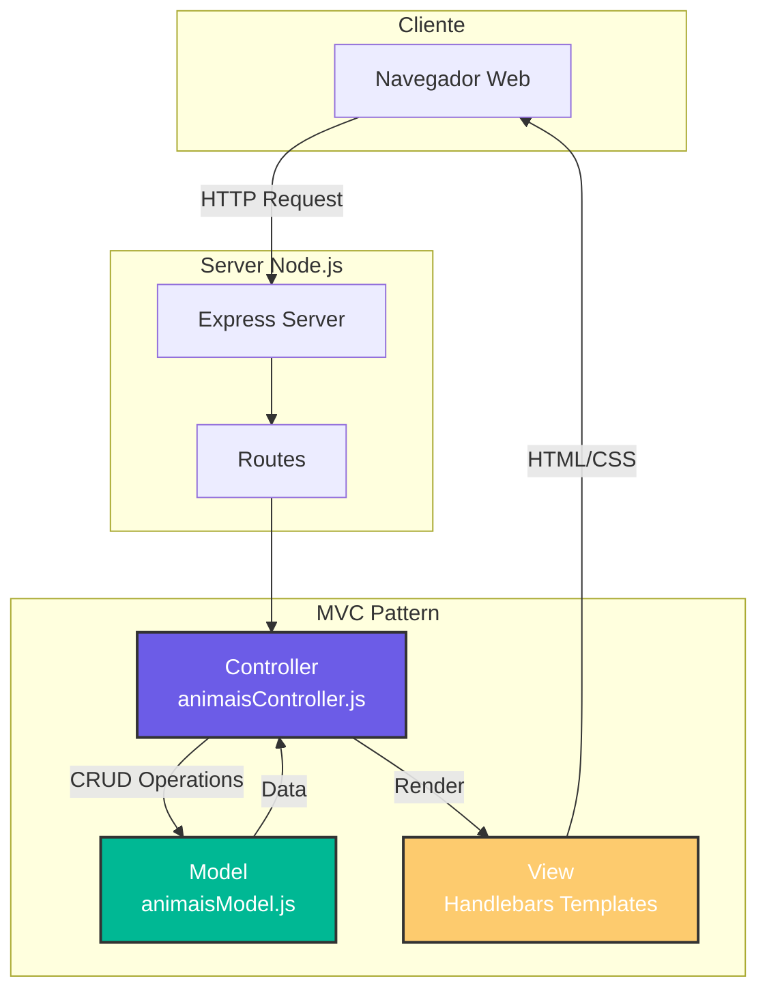

<div align="center">
  
  
  
  <h1 style="font-size: 3em; margin: 0;">🐾 PetManager</h1>
  <h3 style="color: #6c5ce7; margin-top: -10px;">✨ MVC Architecture Pet Management System ✨</h3>
  
  <p>
    
    
    
    
  </p>
  
  <p>
    
    
  </p>

  

</div>

---

## 🌟 **Destaques do Projeto**

<div align="center">
  <table>
    <tr>
      <td align="center">🎯</td>
      <td><b>Arquitetura MVC</b><br/>Separação clara de responsabilidades</td>
      <td align="center">⚡</td>
      <td><b>CRUD Completo</b><br/>Create, Read, Update, Delete</td>
    </tr>
    <tr>
      <td align="center">🎨</td>
      <td><b>Design Moderno</b><br/>Interface responsiva e intuitiva</td>
      <td align="center">🔧</td>
      <td><b>Node.js + Express</b><br/>Backend robusto e eficiente</td>
    </tr>
  </table>
</div>

---

## 📖 **Sobre o Projeto**

<div align="center">
  <blockquote style="font-size: 1.1em; border-left: 4px solid #6c5ce7; padding: 10px 20px; background: #f8f9fa; border-radius: 10px;">
    <i>"Uma aplicação web completa que transforma o gerenciamento de pets em uma experiência simples, elegante e eficiente."</i>
  </blockquote>
</div>

<p align="justify">
  O <b>PetManager</b> é um sistema desenvolvido com propósito educacional para a disciplina de <b>Desenvolvimento Web 3</b>. A aplicação demonstra na prática os conceitos fundamentais do padrão arquitetural <b>MVC (Model-View-Controller)</b>, implementando um sistema completo de gerenciamento de animais de estimação com funcionalidades de cadastro, listagem, edição e exclusão.
</p>

### 🎯 **Objetivos de Aprendizado Alcançados**

- ✅ Compreensão prática do padrão **MVC**
- ✅ Implementação de **rotas dinâmicas** com Express
- ✅ Renderização de **views dinâmicas** com Handlebars
- ✅ Manipulação de dados com **JavaScript puro**
- ✅ **Organização modular** do código
- ✅ **Boas práticas** de desenvolvimento web

---

## 🏛️ **Arquitetura do Sistema**

<div align="center">
  

  
</div>

### 📂 **Estrutura de Diretórios**

```bash
📦 projeto_mvc-desenvolvimento-web3/
┣ 📂 controllers/
┃ ┗ 📜 animaisController.js      # 🎮 Lógica de controle
┣ 📂 models/
┃ ┗ 📜 animaisModel.js           # 💾 Gerenciamento de dados
┣ 📂 views/
┃ ┣ 📜 layout.handlebars         # 🖼️ Template base
┃ ┣ 📜 listaAnimais.handlebars   # 📋 Listagem de pets
┃ ┣ 📜 adicionarAnimal.handlebars # ➕ Formulário de cadastro
┃ ┗ 📜 editaAnimal.handlebars    # ✏️ Formulário de edição
┣ 📂 public/
┃ ┗ 🎨 estilo.css                 # 🎨 Estilização da interface
┗ 🚀 server.js                    # ⚙️ Configuração principal
```

---

## 🛠️ **Tecnologias Utilizadas**

<div align="center">
  
  | 🚀 Backend | 🎨 Frontend | 🛠️ Ferramentas |
  |------------|-------------|-----------------|
  |  |  |  |
  |  |  |  |
  |  | - |  |
  
</div>

---

## 🚀 **Como Executar o Projeto**

<div align="center">
  
</div>

### 📋 **Pré-requisitos**

```bash
✓ Node.js (versão 14 ou superior)
✓ NPM (gerenciador de pacotes)
✓ Git (para clonar o repositório)
```

### 💻 **Passo a Passo**

```bash
# 1️⃣ Clone o repositório
git clone https://github.com/seu-usuario/projeto_mvc-desenvolvimento-web3.git

# 2️⃣ Acesse a pasta do projeto
cd projeto_mvc-desenvolvimento-web3

# 3️⃣ Instale as dependências
npm install

# 4️⃣ Inicie o servidor
npm start
# ou
node server.js

# 5️⃣ Abra o navegador e acesse
🌐 http://localhost:3000
```

---

## 🔗 **Rotas da Aplicação**

<div align="center">
  
| Método | Rota | Descrição | 📍 Status |
|--------|------|-----------|-----------|
| <span style="color:#61affe">GET</span> | `/` | 🏠 Página inicial - Lista todos os pets | 🟢 Ativo |
| <span style="color:#61affe">GET</span> | `/animais/adicionar` | 📝 Exibe formulário de cadastro | 🟢 Ativo |
| <span style="color:#49cc90">POST</span> | `/animais` | 💾 Cadastra novo animal | 🟢 Ativo |
| <span style="color:#61affe">GET</span> | `/animais/:id/editar` | ✏️ Exibe formulário de edição | 🟢 Ativo |
| <span style="color:#49cc90">POST</span> | `/animais/:id/editar` | 🔄 Salva alterações | 🟢 Ativo |
| <span style="color:#f93e3e">GET</span> | `/animais/:id/excluir` | 🗑️ Remove animal do sistema | 🟢 Ativo |

</div>

---

## ✨ **Funcionalidades**

<div align="center">
  
  | Funcionalidade | Descrição | Status |
  |----------------|-----------|--------|
  | 🐕 **Listagem de Pets** | Visualize todos os animais cadastrados | ✅ |
  | ➕ **Cadastro de Pets** | Adicione novos animais com espécie e status vacinal | ✅ |
  | ✏️ **Edição de Pets** | Atualize informações dos animais cadastrados | ✅ |
  | 🗑️ **Exclusão de Pets** | Remova animais do sistema | ✅ |
  | 🎨 **Interface Moderna** | Design responsivo e intuitivo | ✅ |
  | 📱 **Responsividade** | Funciona em dispositivos móveis e desktop | ✅ |

</div>

---

## 🎨 **Preview da Interface**

<div align="center">
  
  ```
  ┌────────────────────────────────────────────────────┐
  │  🐾 PETMANAGER                        [➕ NOVO PET] │
  ├────────────────────────────────────────────────────┤
  │                                                    │
  │  🐕 Rex (Cachorro)                                │
  │  🟢 Status: Vacinado                               │
  │  [✏️ EDITAR]  [🗑️ EXCLUIR]                       │
  │                                                    │
  │  ━━━━━━━━━━━━━━━━━━━━━━━━━━━━━━━━━━━━━━━━━━━━━━━ │
  │                                                    │
  │  🐱 Mimi (Gato)                                   │
  │  🔴 Status: Não Vacinado                           │
  │  [✏️ EDITAR]  [🗑️ EXCLUIR]                       │
  │                                                    │
  │  ━━━━━━━━━━━━━━━━━━━━━━━━━━━━━━━━━━━━━━━━━━━━━━━ │
  │                                                    │
  │  🐦 Piu (Pássaro)                                 │
  │  🟡 Status: Pendente                               │
  │  [✏️ EDITAR]  [🗑️ EXCLUIR]                       │
  │                                                    │
  └────────────────────────────────────────────────────┘
  ```
  
</div>

---

## 📦 **Dependências do Projeto**

<details>
<summary><b>📋 Clique para ver as dependências</b></summary>

```json
{
  "dependencies": {
    "express": "^4.18.2",
    "express-handlebars": "^7.0.7",
    "body-parser": "^1.20.2"
  },
  "devDependencies": {
    "nodemon": "^3.0.1"
  }
}
```
</details>

---

## 🤝 **Contribuição**

<div align="center">
  
  Este é um projeto educacional, mas sugestões são sempre bem-vindas!
  
  <a href="#">
    
  </a>
  
</div>

---

## 👩‍🎓 **Sobre a Autora**

<div align="center">
  
  
  
  ### **Maysa Alexandre Nazario**
  
  <p>
    🎓 Estudante de Desenvolvimento Web<br/>
    💡 Apaixonada por tecnologia e inovação<br/>
    🐾 Amante de animais e código bem escrito
  </p>
  
  <a href="https://github.com/maysanazario">
    
  </a>
  <a href="https://linkedin.com/in/maysanazario">
    
  </a>
  
</div>

---

## 📄 **Licença**

<div align="center">
  
  Este projeto está sob a licença **MIT** - sinta-se livre para usar, modificar e distribuir!
  
  
  
</div>

---

<div align="center">
  
  

</div>
